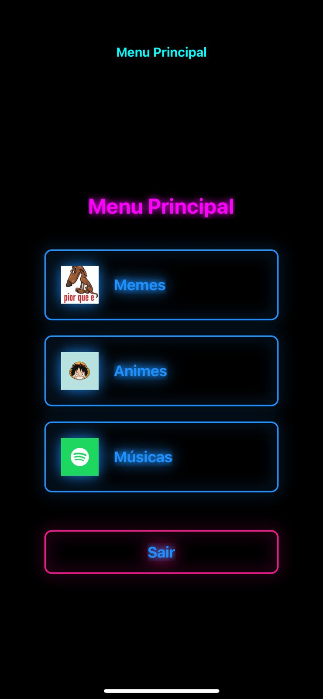
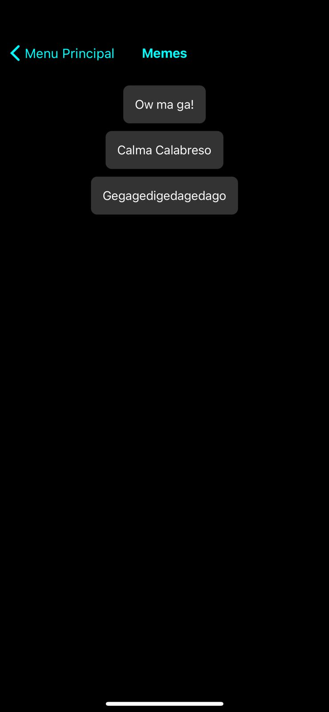
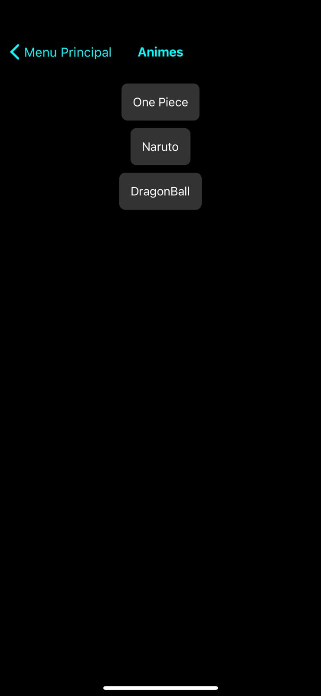
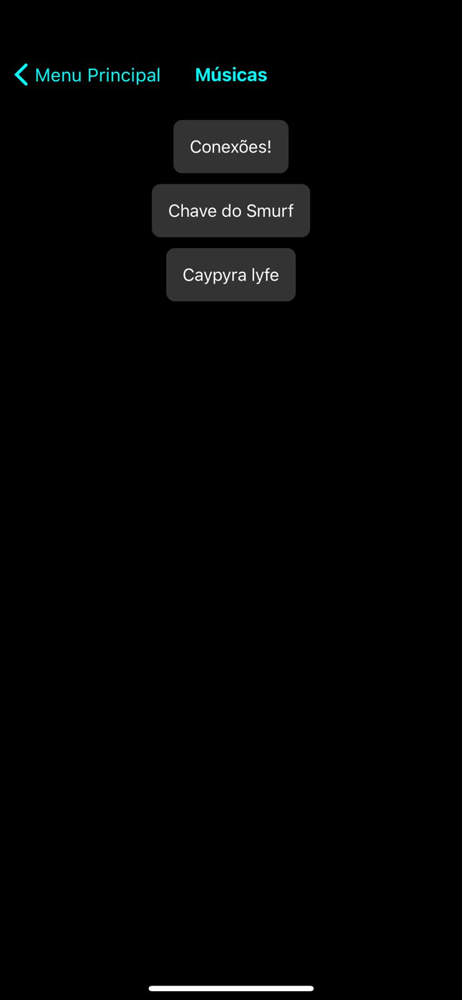

# README 📱✨

## SONGU!

### 🌟 Ideia Geral do Aplicativo

Este aplicativo foi desenvolvido com o objetivo de proporcionar uma experiência diversificada e divertida para os usuários. Ele oferece uma variedade de conteúdos, como memes, músicas, e animes, permitindo que os usuários explorem diferentes formas de entretenimento. O app utiliza uma combinação de componentes visuais e sonoros para tornar a experiência mais dinâmica e envolvente. 🎶😂🎌

### 💡 Motivação

A motivação por trás do desenvolvimento deste aplicativo foi criar algo engraçado, mas também útil! Queria oferecer uma plataforma que permitisse aos usuários se divertirem com conteúdos engraçados da internet, de forma criativa e descontraída. minha motivação veio de varias ocasiões que eu procurei um audio e não conseguia encontrar. 💥🎉

### 🎯 Objetivo

Sabe quando você está conversando com um amigo e lembra de algum som, mas não faz ideia de onde encontrar? Esse aplicativo é o lugar perfeito para isso! Quero proporcionar uma interface acessível e amigável para qualquer pessoa que deseje se entreter rapidamente com um mix de conteúdos frequentemente populares e compartilhados nas redes sociais. A ideia é criar uma experiência que seja divertida, fácil de usar, e que incentive o compartilhamento entre amigos. 🤗🕹️

### 🔥 Funcionalidades

- **🔐 Tela de Login e Cadastro**: Permite que novos usuários se cadastrem e façam login para acessar o aplicativo.
- **🎨 Menu Principal**: Um ponto de partida para todas as funcionalidades do app. O menu principal se adapta visualmente ao movimento do usuário, utilizando o acelerômetro para alterar a cor de fundo, criando um efeito dinâmico e único para cada interação. 🎨📱
- **🎭 Telas de Conteúdo (Memes, Animes, Músicas)**: Cada uma dessas telas traz uma coleção de botões animados que, ao serem pressionados, reproduzem um som específico relacionado ao conteúdo escolhido, como um trecho de música ou um áudio de meme famoso. 🔊😂🎶
- **🎵 Animações e Sons**: A aplicação faz uso de botões animados que reproduzem áudios. Esses sons estão localizados dentro da pasta `assets/sounds` e incluem efeitos sonoros de memes, músicas e frases ou sons de animes. 🎧

### Sensores 🔊📱
Utilizei os sensores de:
- **Audio** : Para tocar os sons dos memes, animes e musicas.
- **Acelerometro** : Para mudar a cor da tela de fundo do menu principal.

### 📸 Capturas de Tela

Aqui estão algumas capturas de tela do aplicativo para você conferir como ele funciona: 

- **Menu Principal**  
  

- **Tela de Memes**  
  

- **Tela de Animes**  
  

- **Tela de Músicas**  
  

